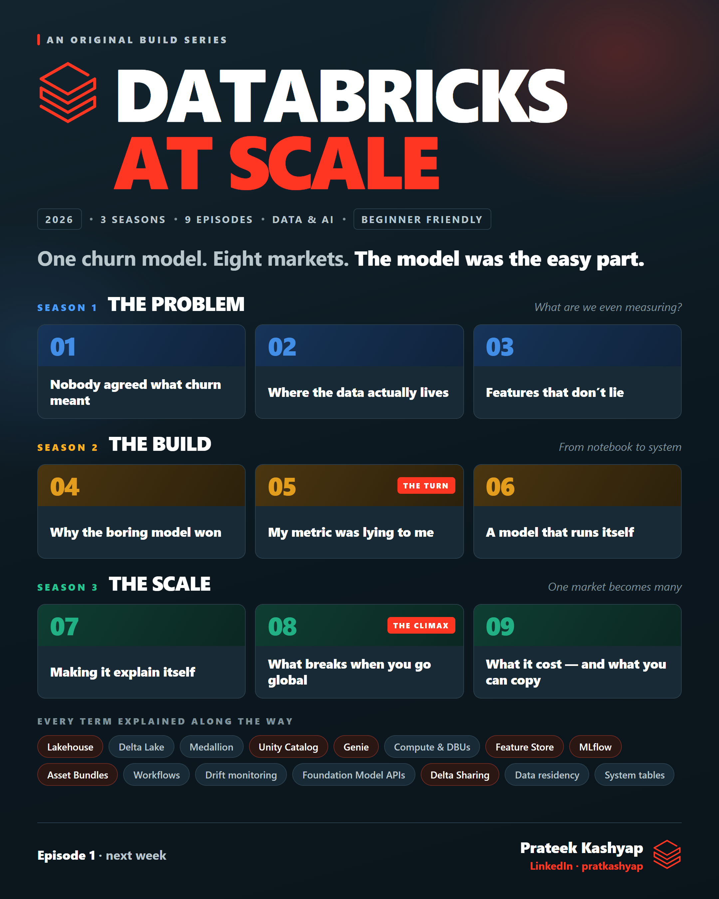

<p align="center">
  
</p>

# Databricks at Scale

**A 9-episode series on building an end-to-end churn prediction system on Databricks, scoring subscribers across eight markets every day, and on everything around the model that nobody warns you about.**

Each episode takes one real moment from the build (a problem, a decision, sometimes a mistake) and explains the part of Databricks that solved it. **Plain English. No Databricks experience needed.**

📺 Follow along on LinkedIn: **pratkashyap**

---

## The series

| | Episode | |
|---|---|---|
| 🎬 | [**Trailer**](episodes/00-trailer/) | ✅ Posted |
| | **Season 1 · The Problem**: *What are we even measuring?* | |
| 01 | [Nobody agreed what churn meant](episodes/01-nobody-agreed-what-churn-meant/) | 🔨 In progress |
| 02 | Where the data actually lives | ⬜ |
| 03 | Features that don't lie | ⬜ |
| | **Season 2 · The Build**: *From notebook to system* | |
| 04 | Why the boring model won | ⬜ |
| 05 | My metric was lying to me ⭐ *the turn* | ⬜ |
| 06 | A model that runs itself | ⬜ |
| | **Season 3 · The Scale**: *One market becomes many* | |
| 07 | Making it explain itself | ⬜ |
| 08 | What breaks when you go global ⭐ *the climax* | ⬜ |
| 09 | What it cost, and what you can copy | ⬜ |

---

## What each episode gives you

- **`learn.md`**: the full breakdown, with every term defined and example SQL
- **`post.md`**: the LinkedIn summary
- **`poster.png`**: the visual
- **`cert-prep.md`**: short recall questions

## What you'll pick up

Lakehouse · Delta Lake · Unity Catalog · Genie · compute & DBUs · feature engineering · MLflow · Asset Bundles · Workflows · drift monitoring · Foundation Model APIs · Delta Sharing · data residency · system tables · cost attribution

---

## Repo at a glance

```
episodes/     the series: one folder per episode
design/       posters, the Databricks logo, the design log, the PNG exporter
docs/         discovery questions
PROGRESS.md   status and next steps
PROJECT.md    the whole project on one page
SETUP.md      Databricks Free Edition in about 15 minutes
```

## About the data

Everything here describes **methods, not results**. Example code uses generic names and synthetic or illustrative numbers. No real subscribers, figures, markets or internal systems.

---

**Prateek Kashyap** · Analytics & Data Science · Streaming & Media · Singapore · LinkedIn: **pratkashyap**
