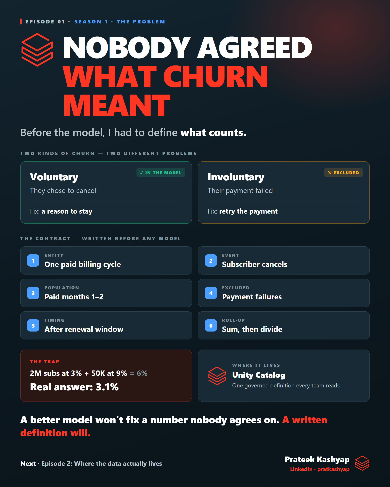

# Episode 01 · Nobody agreed what churn meant

**Season 1 · The Problem**

Before I trained a single model, I had to answer a question that sounds too simple to matter: *what actually counts as churn?* This episode covers the metric contract, why voluntary and involuntary churn are two different problems, the "you can't average churn rates" trap, and where a definition should live in Databricks.

| File | What it is |
|---|---|
| [`learn.md`](learn.md) | **The full breakdown** — start here |
| [`post.md`](post.md) | The LinkedIn post — the summary |
| [`poster.png`](poster.png) | The visual |
| [`cert-prep.md`](cert-prep.md) | Short recall questions |

**Databricks in this episode:** lakehouse · Delta Lake (intro) · Unity Catalog · catalog.schema.table · gold tables · table comments · metric views · AI/BI Genie

← [Trailer](../00-trailer/) · [Episode 02](../02-where-the-data-lives/) →
