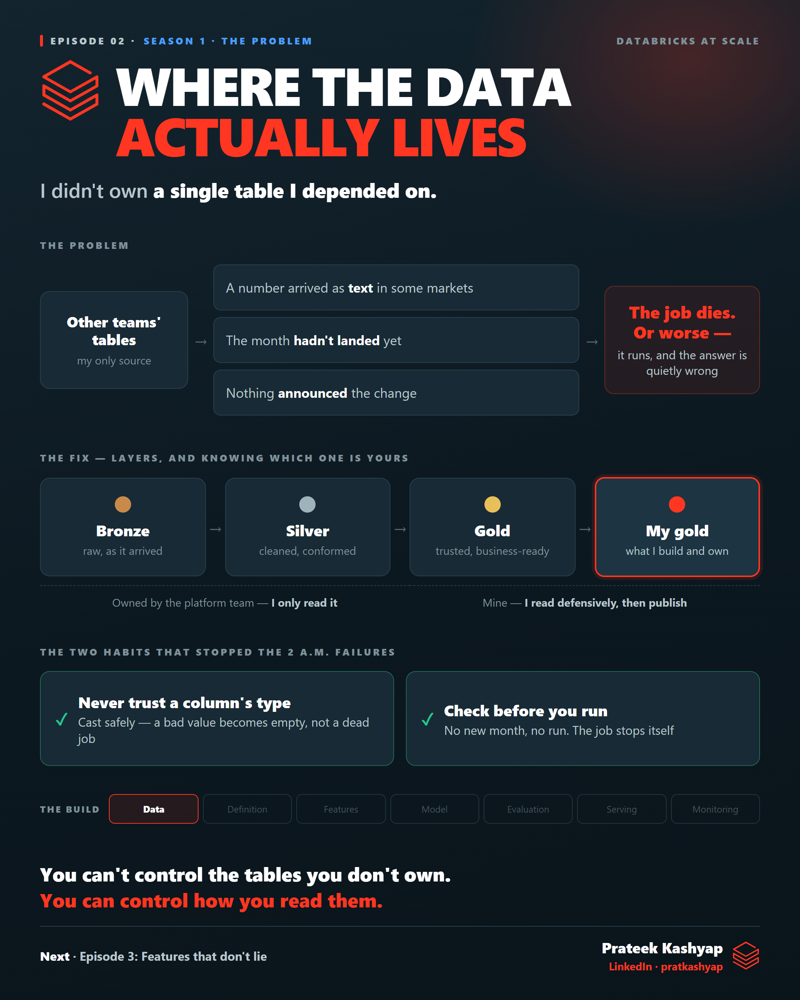

# Episode 02 · Where the data actually lives

**Season 1 · The Problem**

I didn't own a single table the churn project depended on. This episode covers the medallion layers and which one is yours, what Delta gives you underneath, the two habits that stopped the 2 a.m. failures, and how the compute choice shapes the bill.

| File | What it is |
|---|---|
| [`ep02-learn.md`](ep02-learn.md) | **The full breakdown** — start here |
| [`ep02-post.md`](ep02-post.md) | The LinkedIn post — the short version |
| [`ep02-poster.png`](ep02-poster.png) | The visual |
| [`ep02-cert-prep.md`](ep02-cert-prep.md) | Short recall questions |

**Databricks in this episode:** medallion (bronze / silver / gold) · Delta · transaction log · schema enforcement · time travel · `TRY_CAST` and schema drift · freshness gates · job vs all-purpose clusters · SQL warehouse · spot vs on-demand · LTS runtime · Photon

← [Episode 01](../01-nobody-agreed-what-churn-meant/) · [Episode 03](../03-features-that-dont-lie/) →
